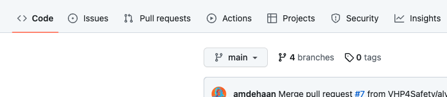
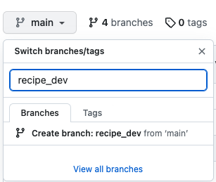
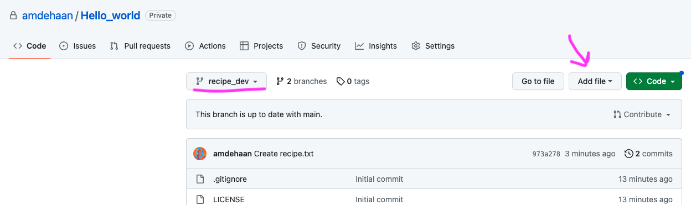
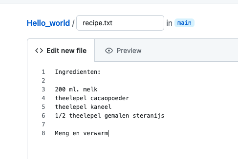
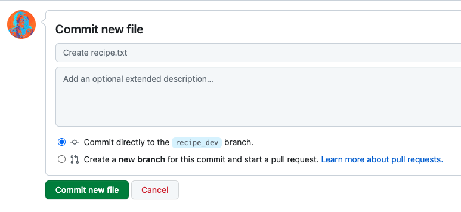
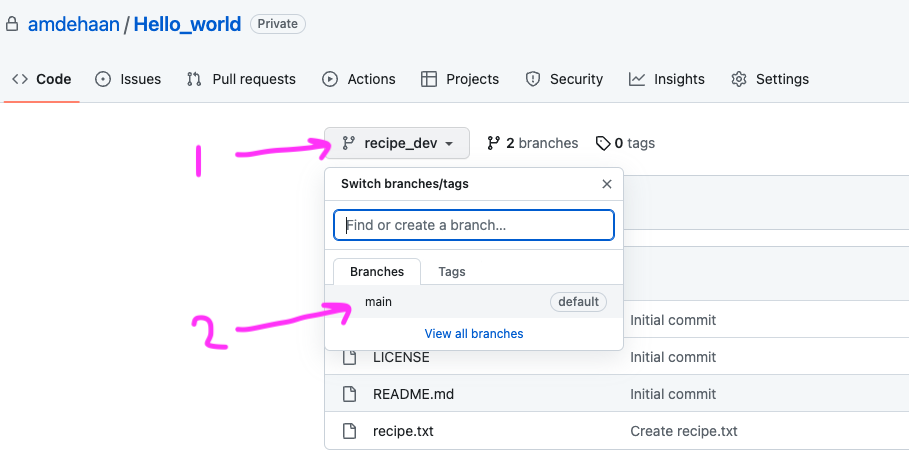
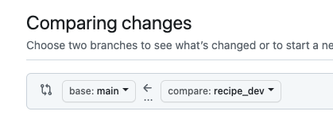
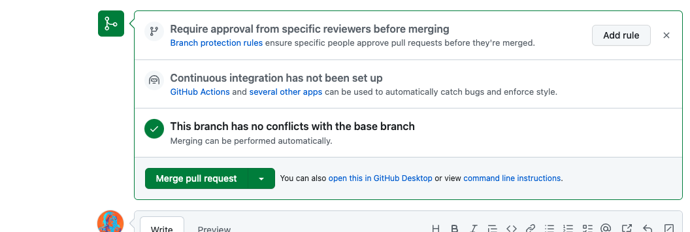

# Part 1: Starting with github

```{r, include=FALSE}
knitr::opts_chunk$set(echo = F, class.source="Rchunk", class.output="Rout")
```

## A version control and Git
We will start with a short presentation on version control systems and git.

---

## B getting to know Github
### Exercise: a real life example (10 min) 

*(Thank you Coderefinery for this exercise, lisenced [CC BY 4.0.](https://creativecommons.org/licenses/by/4.0/))*

On github, you can create and share repositories (folders), which contain the (analyses) code and related files for a project. Git will keep track of all changes to these files. 

Before we create a new repository from scratch and learn how to record changes
and create and merge branches, let us explore an **existing Git repository** on
GitHub. The goal here is not to teach GitHub yet (we will explain some of the
concepts later), but rather to get a glimpse of the wider picture.

As an example we can explore a famous Git repository which was used
to produce the Event Horizon Telescope images: [https://github.com/achael/eht-imaging](https://github.com/achael/eht-imaging).

- History
  - Explore the [repository](https://github.com/achael/eht-imaging). (see explanation of terminology below)
  - Explore the [history](https://github.com/achael/eht-imaging/commits/main).
  - Note that there are [branches](https://github.com/achael/eht-imaging/network).
- Collaboration
  - You can refer to [code portions](https://github.com/achael/eht-imaging/blob/31361ab62c5718b08612fc75e409795f004f5071/ehtim/imaging/starwarps.py#L66-L75)
    (so much simpler to send a link rather than describe which file to open and where to scroll to).
  - Browse the [forks](https://github.com/achael/eht-imaging/network/members).
  - See [contributors](https://github.com/achael/eht-imaging/graphs/contributors).
- Releases
  - Explore the [release history](https://github.com/achael/eht-imaging/releases).
- Reproducibility
  - Discuss the value of the annotation feature: [example file](https://github.com/achael/eht-imaging/blame/main/ehtim/imaging/starwarps.py).

Terminology:

 - **repository** or repo : the version controlled folder. Can be local (on your laptop) or the one on github/gitlab
 - **branch** : git branches are individual projects within a git repository. A temporary copy of the version controlled folder within the same repo (actually, it is a temporary  set of code changes with a name).
 - **fork** A fork is a new repository that shares code and visibility settings with the original “upstream” repository. Forks are often used to iterate on ideas or changes before they are proposed back to the upstream repository, such as in open source projects or when a user does not have write access to the upstream repository.([source](https://docs.github.com/en/get-started/quickstart/fork-a-repo))


### Exercise: Setting up a github repo {.oranje}

We will do this live during the workshop and you will -hopefully- click along. In case you forget the procedure, [see this link.](https://docs.github.com/en/get-started/quickstart/create-a-repo)

###  {.unlisted .unnumbered}

---

## C: Github main workflow

We will: 

 - Start a new branch
 - Add / Change a file and committed those changes to GitHub
 - Open and merge a pull request


### Exercise: main workflow (10 min) 

If you don't have your own github repo yet, make one now. 

   - In the "Repository name" box, type hello-world. 
   - Set it to private (the options are: public: everyone can see the repo / private: only you for a personal repo, or your organisation members for a repo in an organisation githu environment can see this repo.
   - include a .gitignore file (take any template, we use the R one). 
   - Select Add a README file.
   - click "create repository"

**1. create a branch to work in. **

 - On the top left of your repo, click on `main`. It is a dropdown menu.
 
{ width=70%}
</br>

 - In the field `Find or create a branch...` Type a branch name, `recipe_dev`
 - Click Create branch: recipe_dev from main.

{ width=40%}

You now have 2 branches in your repo: the `main` branch which always contains the latest stable version of a project, and the `recipe_dev` branch, that we will use to add a recipe to the repo.

Github switched to your new branch automatically, so the drop down menu should now state `recipe_dev`.

**2. make a change. in this case: add a file.**

 - add a file to your repo called "recipe.txt", containing your favorite recipe for chocolate milk. You can either create this file on github, or create it on your laptop and upload it (make sure you work in the correct branch):
 
{ width=100%}

 - type your recipe, for example:

{ width=40%}

 - scroll to the bottom of the page and click `commit new file` : 

{ width=70%}

Now your two branches are different. 

 - Click on the drop down menu again to switch between branches and explore the difference.
 
{ width=100%}

**3. Open a pull request**

Your recipe_dev branch is now different from the main branch. If you like the changes, you can merge them into the main branch. This is called "pulling".  

To do so, you open a pull request, proposing your changes and requesting that someone review and include your contribution. 

 - click on the `pull requests` tab of your repo
 - click `new pull request`
 - right above the yellow block, you should define which branch is pulled into which other branch. We will pull `recipe_dev` (=compare) into `main` (=base):
 
{ width=30%}

 - Changes to the main branch are shown with red and green highlights.
 - click `create pull request`
 - you can add a title and some info if you like. Also, you can add people you think should be reviewing a change, or connect the changes to a label. We will not cover these topics in the current workshop.
 - click `create pull request` and don't click anything else yet.

**4. Merge a pull request**

Pull requests are not automatically turned into a merge of the two branches. Often, one person is in the lead for a repo, and will determine which changes will be merged. Also, changes in pull requestst can be edited before they are merged. 

For example, if I am a co-author on a paper that is written using github, I will propose changes with a  pull request, but the first author will decide whether to accept them, reject them, or accept with some edits.

I tend to agree with myself: as we have just proposed our own changes, we will now merge them immediately. 

 - Scroll to the bottom of the pull request, click Merge pull request:
 
{ width=30%} 
 
 - Click Confirm merge. 
 - you can now safely delete the `recipe_dev` branch. It is good practice to just open a new branch for a new issue you are resolving.

**branch off, make changes and commit, pull request, merge pull request ** is a main github workflow. 

See also the Github Docs, a great source of [Github tutorials](https://docs.github.com/en/get-started/quickstart/github-flow).

*Note: actually, creating a branch is not necessary, you could directly edit the main branch. But it is not good practice when collaborating.*


### Code along: distributed workflow {.oranje}

We will demo what a distributed git/github workflow would look like from an R user perspective. If you are in fact an R user, use the other "Part 1" item in the table of contents to the left.

Try to code along with the example, even if you do not regularly use programming languages.

###  {.unlisted .unnumbered}

---

#### Distributed workflow for future reference
In short, the core of a github workflow consists of :

##### Give each project its own Git repository

A **Git repository** is a folder in which the version control takes place. That means that all the changes of files that are located in that folder (and its subfolders) are tracked. It is best practice to initiate the Git repository on GitHub and then download it to your computer, so there is a working version of your project in the cloud at any point. Github then acts as a backup system as well.

Just as you can have multiple folders on your computer, you can also have multiple Git repositories on your computer (and on GitHub). It is recommended to create a separate Git repository for each project you are doing. 

##### Commit: Saving a new version of your files 

Git does not automatically track the file changes. If you do not tell Git to save the version history, it will not do anything! Saving a new version of your files in the Git repository's file history is called a **commit**. It is recommended to regularly commit your changes, preferably several times a day, as these commits also form the "tracked changes".

##### Updating the GitHub repository (push)

When you commit your changes, the Git repository on your computer will be updated. However, the online copy of your Git repository on GitHub does not, unless you tell Git to do so. This is called **pushing** (you 'push' the changes from your computer to GitHub).

It is recommended to push your commits at least once per day, to keep the copy of your Git repository on GitHub up to date.

##### Updating your local Git repository based on changes in GitHub (pull)

If you work together with other people, they may be changing the github repository as well. In this case, you want to update your Git repository on your computer based on the changes on GitHub. This update process is the reverse of pushing, hence it is called **pulling** (you 'pull' the changes from GitHub to your computer).

---

## gitignore files

.gitignore files (note the dot) are text files containing a list of files in a repo directory you do not want Git to keep version control on. They will not be uploaded to the github repitory.

.gitignore files make most sense when working distributedly (if that is a word).

Adding files to a .gitignore file needs to be done before asking git to follow a file (stage and commit). A file already added to the index of the repository (i.e. which files git will follow) will not be unfollowed based on the .gitignore. If someone added a file to the .gitignore, but git is still tracking it, this is the problem. 

Unfollowing a file requires that you do some coding to remove it from the index. For instance in the terminal in Rstudio:
 
 `git rm --cached filename`

Here is a nice [list of .gitignore templates.](https://github.com/github/gitignore)

---

## Github and data 

GitHub is not designed for data governance, data quality control, or actually, data at all. However, it *is* designed to organise the workflows around data, specifically data analysis, documentation and text writing (e.g. papers. Or online readers for workshops). It is often used in teams or organizations that work with data-related projects to ensure aspects underlying data flows and can be important in data governance because:

**Version control:** As mentioned above. This allows for transparency and reproducibility in data analysis workflows.

**Collaboration, documentation, meta data:** GitHub's workflow helps to ensure that documentation is a central part of a project's process by lowering the threshold for providing meta data and working reproducibly. Also, using github offers multiple stakeholders the option to review, or keep track of, how data is being used in an organisation.

**Security and access control:** GitHub offers a range of security features, such as two-factor authentication, encryption, and access control, which can help to ensure that data-related projects and workflows are secure and only accessible to authorized individuals. At least a lot more secure than e-mailing google drive links or scripts.

**Openness and transparency:** As you share all your changes with your coworkers, it promotes accountability and responsible data practices.

### No really, github and data

Fair enough. So what about the data?

While GitHub does provide some basic data storage capabilities, such as the ability to store small datasets or documentation files, it is generally not recommended to store large datasets or sensitive data on GitHub. Its version control is catered towards code and text, not data. This means that it may be difficult to track changes to datasets over time, and to revert to previous versions of a dataset if necessary.
Larger datasets will also exceed the storage limits, which can impact performance and functionality.

Also, GitHub is a public platform, and while repositories can be private and are secure, most organisations have rules and dedicated data storage solutions in place on where to store data, particularly for sensitive or confidential data.

---

## Thinking in projects

A github repository is centered around the idea of dividing your work in projects (rather than tasks), and storing all files related to a project in one location.

A task-centered folder structure on a researcher's laptop could look somewhat like the way both of your teachers today organised their laptops previously:

```
old_laptop/wrong_structure
├── courses
├── ethical approval documents
├── failed projects
├── images
├── manuscripts
│   ├── me_et al , 2020_v01 - Copy.docx
│   ├── me_et al , 2020_v02.docx
│   └── me_et al about A, 2020_v03_final_final.docx
├── presentations
├── project A
│   ├── Data files 001
│   ├── Project Documentation
│   ├── Volunteer responses
│   ├── analyses
│   └── revision
│       ├── new analyses
│       ├── new figs
│       └── replies to reviewers
└── protocols
```

While a project-centered structure may look like this : (this structure specifically is actually based on [Guerilla analytics](https://guerrilla-analytics.net/) but other options are available. For example, you could take a look at [cookiecutter templates](https://www.cookiecutter.io/templates) if you want a Python-based approach or the [worcs package](https://content.iospress.com/articles/data-science/ds210031) for R.

```
new_laptop/better_example_structure
├── courses
├── project A
│   ├── analyses
│   │   ├── code
│   │   ├── data
│   │   └── data_raw
│   │       └── Volunteer responses
│   ├── documentation
│   ├── ethical approval
│   ├── images
│   ├── manuscript
│   │   ├── me_et al , 2020.docx
│   │   ├── version 1
│   │   └── version 2
│   ├── methods
│   │   └── protocols
│   └── presentations
├── project B
└── project C
```

Now, `project A` and `project B` could easily be github repo's (although data itself is often not stored on github )

The data workflow could then consist of:

 - a github/gitlab repository that version controles everything you do with your data (most importantly, analysis scripts)
 - a secure location to store raw data and not touch or change it: read-only. 
 - a data repositorie that stores the to be used data your are analysing and collaborating on. Usually organisations have something in place, for instance Research Drive, dedicated servers or even google drive.


