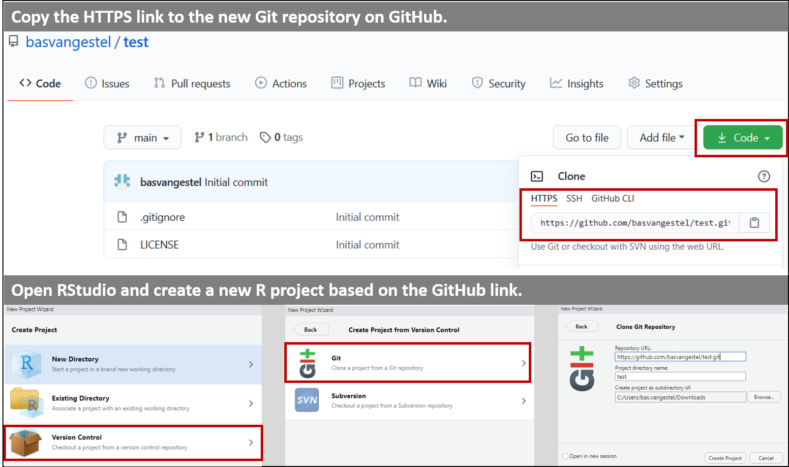
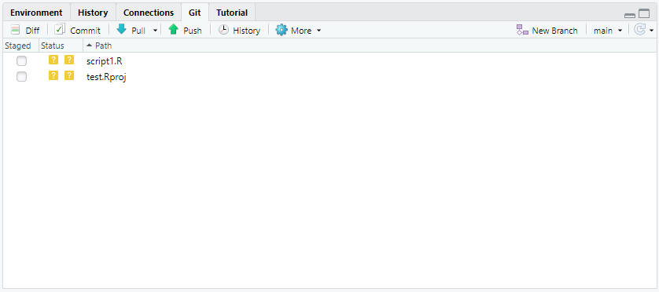
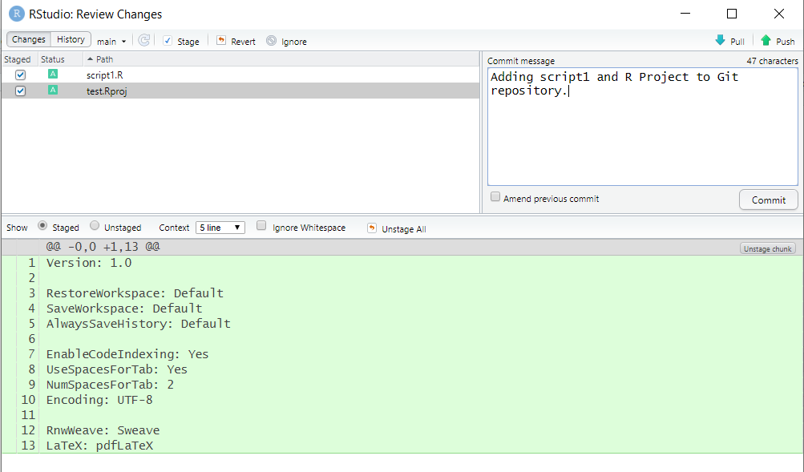
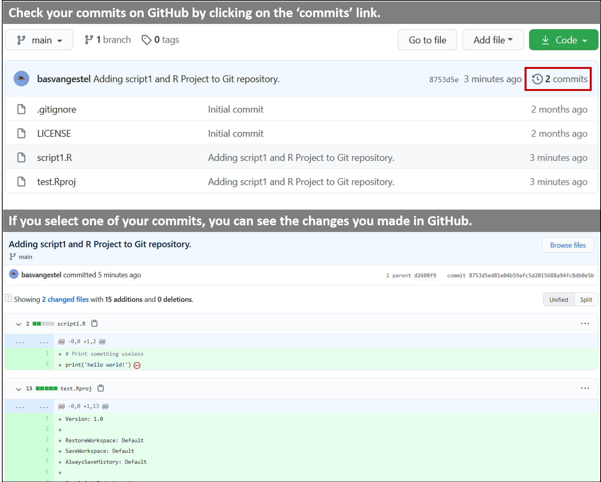
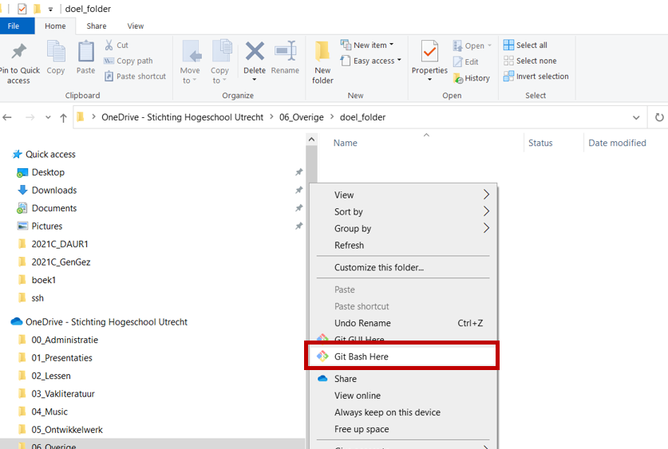

# Part 1: Starting with github for coders

```{r, include=FALSE}
knitr::opts_chunk$set(echo = F, class.source="Rchunk", class.output="Rout")
```

If you are using programming languages, and are already on a "I have seen some repo's before, I roughly know what pushing and pulling is" level of friendship with git/github, this page is for you.


## A version control
We will start with a short presentation on version control systems and git.


## B Setting up a repo

(note: we will do this with a demo as well lateron. Feel free to ignore us if you have already completed this part and know what you are doing)

To set up your Git repository, you go to the [GitHub login page](https://github.com/login) and log in with your credentials. You are then taken to the home page. On the left side, you can find a panel with your repositories (if you have any). Here, you can click on 'New' to create a new repository (see figure below, top panel). 

Once you click on 'New', you will be taken to a menu were you can specify the details of your new Git repository. The menu consists of the following parts (see also figure below, bottom panel):

1. **Repository name field**: in the repository name field you can specify the name for your new repository. GitHub will automatically check if another repository with the same name already exists. 
1. **Public or Private**: when you create a new repository, you have to indicate if you want to create a public or a private repository. A **public repository** can be found and downloaded by anyone on the internet (although only specified persons can contribute to the Git repository). A **private repository** is only accessible to persons specified by you (the owner). Although you promote reproducible research by creating a public repository, this not always possible. Especially if you are employed (or doing an internship!) at a company or other agency, your employer often does not allow you to make your files public. Always check with your employer (or supervisor) to see what is allowed. *Choose a private repository if you are not sure!*
1. **Initialization files**: when you create a repository, you can create some 'initialization files'. These files include a README file, a gitignore file and a license:
  a. **README file**: a README file is a file that contains information about the repository. This file should be read by everyone that is planning to use the files in the repository. It usually contains information about the content of the Git repository. You can create the README file when creating the Git repository, but you can also do it later. 
  a. **gitignore file**: we will explain the purpose of the gitignore file in detail below. In short, the gitignore file contains all the file names of files that should *not* be tracked by Git. That means that you cannot commit changes to files that are in the gitignore file. On GitHub, you can easily create a gitignore file that is specific for the programming language you are using. It is therefore recommended to create a gitignore file (for example for R) when creating the Git repository.
  a. **License**: when you create a public repository, it is important to add a license to your repository. The license states what others can do with the files in the Git repository. For example, with an MIT license, you allow others to use your file for any purpose they like (even for commercial applications). Similarly, if you want to use the files of others, it is important to check their license to see what you can and cannot do. Please check the resources for more information about licenses.  


## C connecting Rstudio to Github

We will use Rstudio (Posit) for this lesson, workflows in other software is very similar. 


### Step 1: Downloading the Git repository to your computer (cloning) {-}

Once you have created a Git repository on GitHub, you can download the repository to your computer. Downloading a Git repository is called **cloning**. The steps for cloning a Git repository are as follows:

1. Copy the GitHub link to the new Git repository (see figure below, top panel). 
2. In RStudio, go to File > New Project...
3. In the Project menu, select 'Version Control', then 'Git' and subsequently enter the details of the Git repository (see figure below, bottom panel). Also select the folder in which you want the repository to be located. 
4. Click 'Create Project'. 

RStudio will now create a new R Project and clone the Git repository from GitHub. 

It is best practice to use R Projects if you are working with RStudio. Using the above steps, you can easily couple the R Project to the Git repository. All files in the R Project folder will now be tracked for version control. These files can be R scripts, (R)markdown files, but also (among others) bash scripts. 

```{r echo=FALSE, fig.align='center', fig.cap='Downloading the Git repository to your computer using RStudio. See the main text for the details.'}

```


### Step 2: Git personal access token

Github uses personal access tokens. You will have to generate one on github, and tell Rstudio / git on your computer what it is.

Copy the following to the console:

```{r, eval=F}
install.packages("gitcreds")
library(gitcreds)
gitcreds_set()
```

Rstudio asks for a github token. Let it wait for a bit. Go to your browser. Generate a **classic** token by following [these steps](https://docs.github.com/en/authentication/keeping-your-account-and-data-secure/creating-a-personal-access-token). 

Copy your token (you only get to see it once!) and paste it in Rstudio (who was still waiting for your reply).

You will probably have to give Rstudio your github name and password later as well. It will ask you for it.

## Getting started with Git in RStudio {-}

OK, you are ready to go! You have created your first Git repository and you can now start to add files and track their changes. In this part, we will show you how to commit your changes and how to push your changes to the Git repository on GitHub. 

We will start by creating a new R script and saving it in the directory of the Git repository. In the right upper corner of RStudio, you can find a submenu called 'Git'. If you open this menu, you can see the changes you have made to the repository (see figure below). These changes may be new files that you just added to the repository, but they also can be changes to the content of pre-existing files. 

```{r echo=FALSE, out.width='70%', fig.align='center', fig.cap='Git menu in RStudio.'}

```

In this Git menu, you can perform all your Git actions, including committing your changes, pushing your changes to GitHub or pulling GitHub changes to your computer. We will now discuss these steps in detail. 


## D: Github distributed workflow

In short, the core of a github workflow consists of :

#### Give each project its own Git repository

A **Git repository** is a folder in which the version control takes place. That means that all the changes of files that are located in that folder (and its subfolders) are tracked. It is best practice to initiate the Git repository on GitHub and then download it to your computer, so there is a working version of your project in the cloud at any point. Github then acts as a backup system as well.

Just as you can have multiple folders on your computer, you can also have multiple Git repositories on your computer (and on GitHub). It is recommended to create a separate Git repository for each project you are doing. 

#### Saving a new version of your file (commit) 

You just created a new R script (if you did not, do it now). In addition, by cloning your Git repository from GitHub, you created a new R Project file. These changes need to be stored in the Git repository. In other words, you need to commit the changes to the Git repository. You can do this by clicking on the 'Commit' button in the Git menu. A new window will then open. In this window, you can select the changes you want to commit to the Git repository (see figure below, left upper corner). Note that by selecting a file, you can see the changes in the bottom panel of the window (in which lines in green are new/added lines and lines in red are old/removed lines). After selecting the files you want to commit, you can write a commit message in the upper right panel. This commit message is necessary to later on easily distinguish the different commits in GitHub. It is therefore important to write commit messages that clearly indicate the changes you made in the commit. Finally, you can commit your changes by pressing the 'Commit' button. You can now close the commit window (also the other window that pops up after pressing the 'Commit' button).  

```{r echo=FALSE, out.width='80%', fig.align='center', fig.cap='Committing changes in RStudio.'}

```

#### Updating the GitHub repository (push) {-}

After committing your changes, you have to update the GitHub repository. You can do this by pushing the recent commit(s) to GitHub using the 'Push' button (with the green, upward pointing arrow) in the Git menu.

The first time you push commits to GitHub from a repository in RStudio, you will be prompted for your user name and password. Likely, Rstudio will save your credentials, so that you will not have to enter them again. **If it doesn't**, type the following in the terminal:


git config --global user.email "you@example.com"

git config --global user.name "Your Name"


After pushing your changes, you can see the new/changed files in GitHub (you may need to refresh your page to see the changes). GitHub also offers a nice interface to see the exact file changes for each commit. In the main menu of your repository, you can click on the 'commits' link and subsequently select your most recent commit. You will then see all file changes that were committed during that commit (see figure below). 

```{r echo=FALSE, out.width='80%', fig.align='center', fig.cap='Check out your commits in GitHub.'}

```


#### Updating your local Git repository based on changes in GitHub (pull)

If you work together with other people, they may be changing the github repository as well. In this case, you want to update your Git repository on your computer based on the changes on GitHub. This update process is the reverse of pushing, hence it is called **pulling** (you 'pull' the changes from GitHub to your computer).

If multiple people are working on a repo, you may need to pull changes before pushing your changes.

However, if multiple people are working on a repo, just use good github etiquette and work in separate branches. [Make the branch](https://docs.github.com/en/pull-requests/collaborating-with-pull-requests/proposing-changes-to-your-work-with-pull-requests/creating-and-deleting-branches-within-your-repository) on github.com and pull any branch from Rstudio to get the new branch locally as well.

### Ignore files for version control (gitignore) {-}

Some file changes do not have to be tracked by Git. These include file changes to files that are generated automatically by R (such as .RData and .Rhistory files) or other software. You can indicate to Git to ignore these files by creating a **gitignore** file in the Git repository. This is just a simple text file that is saved as '.gitignore' in the Git repository. In this file, you store the names of the files you want to ignore. You can also ignore entire directories or files with a certain file extension (see [this page](https://git-scm.com/docs/gitignore#_pattern_format) for the syntax). 

As indicated above, you can easily create gitignore files on GitHub when you create your Git repository. On GitHub, you can select your programming language and then create a gitignore file that ignores system files of that programming language. You can always add other files and directories to the gitignore file yourself later. 

### Using Git outside RStudio

In the text above, we explained how to use Git in combination with RStudio. However, you may also want to use Git with other programming languages, such as Python or Bash, outside RStudio. Of course this is possible. In fact, Git was designed to be used independently, as a simple command line tool. Once you install Git on your computer, you also install the Git Bash command line tool. You can use this tool in every directory of your computer to initiate Git repositories or to maintain them. Below, we will show you how you can do this and we learn you the most important commands. 

Suppose you want to clone the Git repository outside RStudio in a directory on your computer. You can do this by browsing on your computer to the destination folder. In this folder, you can right click with your mouse and select 'Git Bash Here' (see figure below). A command line will open, which is basically a Linux command line. 

```{r echo=FALSE, out.width='80%', fig.align='center', fig.cap='Open Git Bash tool in a folder on your computer.'}

```

You can now clone the Git repository from GitHub using the following command (of course replacing the link with the link of your own repository):

```{bash echo=TRUE, eval=FALSE}
git clone https://github.com/basvangestel/test.git
```

A new folder will now be created. In this folder, the files of your Git repository are located. Now you can go to this folder and add/change files. With the following command you can see which files have been changed:

```{bash echo=TRUE, eval=FALSE}
git status
```

You can commit the file changes with the following command:

```{bash echo=TRUE, eval=FALSE}
git add --all; git commit -m 'your-message'
```

This command may look a bit difficult. The first part (`git add --all`) corresponds to selecting (all) the files in the RStudio commit window. Note that with this command you commit all file changes, unless they are ignored as indicated by the gitignore file. The second part (`git commit -m 'your-message'`) corresponds to writing your commit message and pressing the commit button in the RStudio commit window. 

Finally, you can push and pull changes using the following commands:

```{bash echo=TRUE, eval=FALSE}
git push origin main
git pull origin main
```

<div class="question">
###### Exercise 
**making a repo** 

a) Create a new Git repository on GitHub. Make sure that the Git repository contains a gitignore file for R.  
b) Clone the Git repository to your computer using RStudio (hence creating an R Project on the fly).
c) Create an RMarkdown file in the Git repository with the following content:

```{r echo=TRUE, eval=FALSE}
---
title: "My own RMarkdown file"
output: html_document
---

This is my first RMarkdown file tracked by Git!!
```

d) Commit the changes to the Git repository and push the changes to GitHub. Check the commit on GitHub to inspect the file changes.
e) Add some extra lines to the RMarkdown file and change the title. Commit the changes and push the changes to GitHub. Check the commit on GitHub to inspect the file changes.
</div>

## Github and data 

GitHub is not designed for data governance, data quality control, or actually, data at all. However, it *is* designed to organise the workflows around data, specifically data analysis, documentation and text writing (e.g. papers. Or online readers for workshops). It is often used in teams or organizations that work with data-related projects to ensure aspects underlying data flows and can be important in data governance because:

**Version control:** As mentioned above. This allows for transparency and reproducibility in data analysis workflows.

**Collaboration, documentation, meta data:** GitHub's workflow helps to ensure that documentation is a central part of a project's process by lowering the threshold for providing meta data and working reproducibly. Also, using github offers multiple stakeholders the option to review, or keep track of, how data is being used in an organisation.

**Security and access control:** GitHub offers a range of security features, such as two-factor authentication, encryption, and access control, which can help to ensure that data-related projects and workflows are secure and only accessible to authorized individuals. At least a lot more secure than e-mailing google drive links or scripts.

**Openness and transparency:** As you share all your changes with your coworkers, it promotes accountability and responsible data practices.

### No really, github and data

Fair enough. So what about the data?

While GitHub does provide some basic data storage capabilities, such as the ability to store small datasets or documentation files, it is generally not recommended to store large datasets or sensitive data on GitHub. Its version control is catered towards code and text, not data. This means that it may be difficult to track changes to datasets over time, and to revert to previous versions of a dataset if necessary.
Larger datasets will also exceed the storage limits, which can impact performance and functionality.

Also, GitHub is a public platform, and while repositories can be private and are secure, most organisations have rules and dedicated data storage solutions in place on where to store data, particularly for sensitive or confidential data.


## Thinking in projects

A github repository is centered around the idea of dividing your work in projects (rather than tasks), and storing all files related to a project in one location.

A task-centered folder structure on a researcher's laptop could look somewhat like the way both of your teachers today organised their laptops previously:

```
old_laptop/wrong_structure
├── courses
├── ethical approval documents
├── failed projects
├── images
├── manuscripts
│   ├── me_et al , 2020_v01 - Copy.docx
│   ├── me_et al , 2020_v02.docx
│   └── me_et al about A, 2020_v03_final_final.docx
├── presentations
├── project A
│   ├── Data files 001
│   ├── Project Documentation
│   ├── Volunteer responses
│   ├── analyses
│   └── revision
│       ├── new analyses
│       ├── new figs
│       └── replies to reviewers
└── protocols
```

While a project-centered structure may look like this : (this structure specifically is actually based on [Guerilla analytics](https://guerrilla-analytics.net/) but other options are available. For example, you could take a look at [cookiecutter templates](https://www.cookiecutter.io/templates) if you want a Python-based approach or the [worcs package](https://content.iospress.com/articles/data-science/ds210031) for R.

```
new_laptop/better_example_structure
├── courses
├── project A
│   ├── analyses
│   │   ├── code
│   │   ├── data
│   │   └── data_raw
│   │       └── Volunteer responses
│   ├── documentation
│   ├── ethical approval
│   ├── images
│   ├── manuscript
│   │   ├── me_et al , 2020.docx
│   │   ├── version 1
│   │   └── version 2
│   ├── methods
│   │   └── protocols
│   └── presentations
├── project B
└── project C
```

Now, `project A` and `project B` could easily be github repo's (although data itself is often not stored on github )

The data workflow could then consist of:

 - a github/gitlab repository that version controles everything you do with your data (most importantly, analysis scripts)
 - a secure location to store raw data and not touch or change it: read-only. 
 - a data repositorie that stores the to be used data your are analysing and collaborating on. Usually organisations have something in place, for instance Research Drive, dedicated servers or even google drive.


