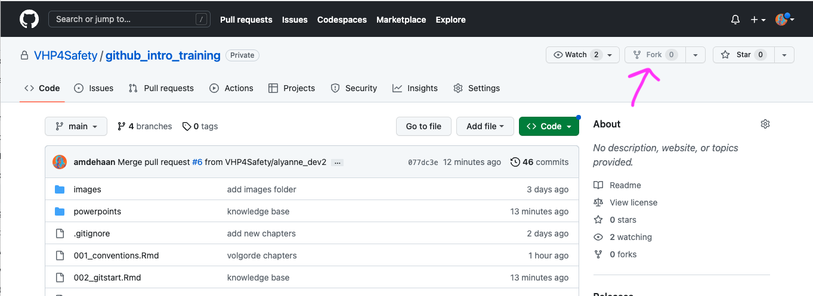
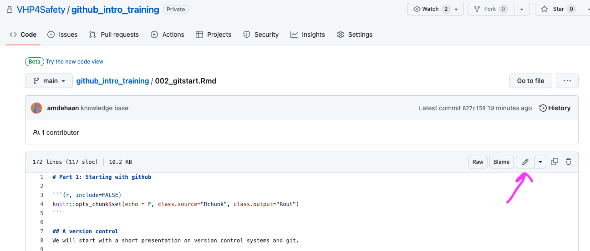
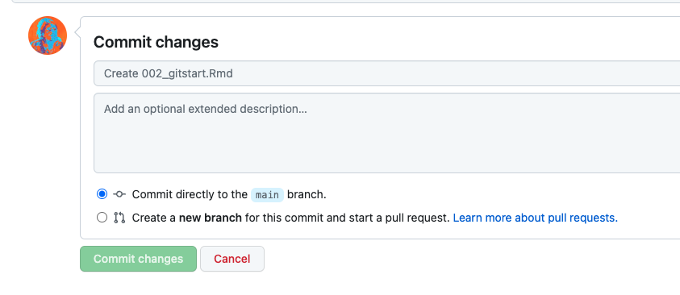
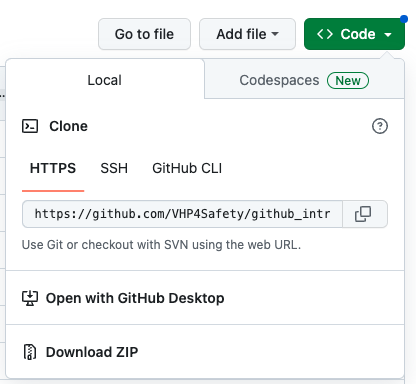

# Part 2: Github in collaborations
```{r, include=FALSE}
knitr::opts_chunk$set(echo = F, class.source="Rchunk", class.output="Rout")
```

## A: collaboration on github

### Exercise: forking 

Note: we would like to mention that if you want to keep complete control over a repo, and be able to repair major screw ups such as putting secret files on a public github repo, you should [disable forking](https://docs.github.com/en/repositories/managing-your-repositorys-settings-and-features/managing-repository-settings/managing-the-forking-policy-for-your-repository).

We like to live on the edge, so our reader repo is forkable and public. 

 - Go to the [reader repo](https://github.com/VHP4Safety/github_intro_training)
 - Fork the reader. You now have a personal copy in your github cloud environment.
 
 { width=100%}
 
 - Go back to your own github environment, and find the new repo.
 - Open some Rmd files and find a typo or someting you would like to improve in the reader. 

{ width=100%}

 - Fix it, scroll down and and commit your changes 

  { width=100%}

 - Make a pull request to include your forked version in our reader 
 - We will merge your changes to our reader if we like them :)

---

### cloning or downloading

Alternatively, if you want to work on a repo without adding your work back into the original, you can just download a .zip file with all the files (probably the way to go for a reprohack):

{ width=60%}

You can also clone a repo to your laptop to work on it locally. This was covered in the demo before the lunch, and is necessary for working offline in a distributed way.

## B: Licenses

Software licenses are legal agreements that determine how a software application can be used by individuals or organizations. 

We think public repos should always have a license. You can find our [here.](https://github.com/VHP4Safety/github_intro_training/blob/main/LICENSE.txt)

Having a license is however not obligatory. Without a license, the default copyright laws apply: you own the thing and no one may reuse it. However, if you publish something in a **public** repository on github.com, other users of GitHub.com have the right to view and fork your repository. **If you change your mind and make a repository private, excisting forks of the repo will not disappear from other user's github account.**

If you're creating an open source project, we strongly encourage you to include an open source license. Data stewards will probably know more about this than we do, but if you need help choosing a license, see [this website](https://choosealicense.com/).


### Types of software licences
There are various types of licenses that software developers use to protect their intellectual property and control the distribution and usage of their software. Some of the common types of software licenses include:

 - Proprietary License: a restrictive license that allows the software to be used only as per the terms and conditions specified by the software developer. Often used commercially.
 - Open Source License: license that allows users to access, use, modify, and distribute the software freely. The key characteristic of open source software is that the source code, or the human-readable version of the software, is available for anyone to view and modify. 
 - Freeware: license that allows users to download, install, and use the software for free without any monetary cost. 
 - Shareware: license that allows users to try the software for free for a limited period, typically 30 days, before requiring them to purchase a license to continue using the software. 
 - Subscription License: grants  access to the software for a specified period in exchange for a recurring fee. 
 
### Creative Commons Flavours
Creative Commons (CC) licenses are a type of open source license that provide a standardized and flexible way for content creators to share their work with others while retaining certain rights. There are several flavors of Creative Commons licenses, each with its own set of permissions and restrictions.

The most permissive CC license is the **CC0 (CC Zero) license**, which allows content to be used, modified, and distributed without any restrictions. This means that the content can be used for any purpose, including commercial use, without requiring attribution to the original creator.

CC licensing is usually a combination of one or more of the following the following:

 - The **Attribution (BY)** license requires that the original creator be credited when the content is used, modified, or distributed. 
 - The **ShareAlike (SA)** license requires that any modifications or derivatives of the content be shared under the same license. This means that if someone modifies the content, they must also release their modifications under the same Creative Commons license. 
 - The **NonCommercial (NC)** license. This means that the content can be used, modified, and distributed for non-commercial purposes only, such as for personal or educational use, but not for commercial gain.
 - The **NoDerivatives (ND)** license prohibits any modifications or derivatives of the content. This means that the content must be used and distributed without any modifications.

### Exercise: add a license to your repo 

Please go over this [Github documentation](https://docs.github.com/en/communities/setting-up-your-project-for-healthy-contributions/adding-a-license-to-a-repository) to add a license to your Hello_world repo even though it is set to private, as a practice. 

---

## C: security

*TLDR: do not put stuff online in public repo's that you do not want the world to know. If you mess up, most stuff can be fixed, but it is probably easier to change your passwords and don't mess up again. In general, we recommend not uploading compromising pictures or other top secret files to public repo's.*

Github security could be its own 1-day workshop. So we'll just direct you to [this summary](https://spectralops.io/resources/how-to-choose-a-secret-scanning-solution-to-protect-credentials-in-your-code/), this [github doc](https://docs.github.com/en/authentication/keeping-your-account-and-data-secure/) and highlight 2 important aspects: github tokens, and the fact that you should not store passwords in text in a github repo.

Also, we would like to mention again that if you want to keep complete control over a repo, you should [disable forking](https://docs.github.com/en/repositories/managing-your-repositorys-settings-and-features/managing-repository-settings/managing-the-forking-policy-for-your-repository).

### Github tokens

First of all, there is security of github itself. Anyone using github in a data analysis workflow probably interacts with the Github API. In whch case you need a personall access token. You can get them from github.com under settings, see [here](https://docs.github.com/en/enterprise-server@3.4/authentication/keeping-your-account-and-data-secure/creating-a-personal-access-token)

GitHub tokens are access credentials that serve as a secure way to authenticate and interact with the GitHub API. The purpose of GitHub tokens is to provide users with way to programmatically access and manipulate GitHub repositories without exposing your password. 

For future reference, you can find how to do use github tokens with Rstudio [here](#tokens)


### Using passwords when coding

But what about access to other locations, such as NCBI or data servers?

Storing keys, passwords, or any sensitive information directly in code can pose a security risk, as it increases the likelihood of accidental exposure or unauthorized access. This is especially true when working with APIs (a way for two or more computer programs to communicate with each other) that require authentication.

Best practice is to separate sensitive information, such as keys or tokens, from the code and manage them securely. So: do not add the password to anything in plain text to your github repo. Which sounds obvious, but is [often forgotten in the flow of things.](https://qz.com/674520/companies-are-sharing-their-secret-access-codes-on-github-and-they-may-not-even-know-it)

For instance, when you write an analysis that uses an API key for something, you often approach a server somewhere with a URL similar to:

```{r, eval=F}
“https://somewebsite.org/data/543/thedataiwant?&id=abcde12345”
```

and use a piece of code similar to this to reach it (this example is in Python):

```{r, eval=F}
api_key = "abcde12345" 
dataversion = "543" 
base_url = "https://somewebsite.org/data/" 
datatype = "/thedataiwant?"
url = base_url + "dataversion" + datatype + "&id=" + api_key

GET url

```

However, now your api key is available for everyone with access to the repo. 

Instead, you can use a separate file which includes the api key, which is **not synced with github** and import this file in the analysis script. (example below, no need to try this out, just to clarify what we mean) :

 - make a separate file called for instance `secret_api.py` which consists only of a line `api_key = abcde12345`
 - add secret_api.py to the .gitignore file so it does not sync with git
 - change the code above to
 
```{r, eval=F}
import secret_api.py
api_key = "abcde12345" 
dataversion = "543" 
base_url = "https://somewebsite.org/data/" 
datatype = "/thedataiwant?"
url = base_url + "dataversion" + datatype + "&id=" + secret_api.api_key

GET url

```

Perhaps, try all this with a false API key before you use the real one. 

In R, one approach to make your life easier is to use environment variables or configuration files on your own computer. Find this method [here.](#passwords).


### Case: password panic 

Suppose a researcher comes to you stressed: they included a password to their NCBI account in a public github repo and now it is visible online. No breach of AVG level panic, but still, they want it gone. What to do?

 1. first: advise them to change the passwords. obviously.
 1. There is a method to [erase things from git repo's and their history.](https://docs.github.com/en/authentication/keeping-your-account-and-data-secure/removing-sensitive-data-from-a-repository) It is painful though. [git filter-repo](https://github.com/newren/git-filter-repo) is recommended. Stackoverflow also has several [discussions on the topic.](https://stackoverflow.com/questions/872565/remove-sensitive-files-and-their-commits-from-git-history) If you need to do this and are not used to bash programming, we recommend calling in one of your programming colleagues. 
 1. However... consider: 
   - Is the leaked info a password you used once? 
     - Take your loss, change the passwords, learn your lesson and next time use environment variables, configuration files or just typing them manually every time.
   - Is the leaked info a password you use all over the internet?
     - change all your passwords
     - learn how to use a [password manager](https://www.g2.com/categories/password-manager/free)
   - leaked info was not a password, but some secret file?
     - this would be a good moment to contact github support
     - if your repo is not forked by anyone, and you don't care about losng all your issues, you can just delete the repo. 

### Exercise: prepare what to tell people 

 1. In groups of 2: discuss the potential security risks associated with storing keys in code when using GitHub as a version control system. Discuss the risks of accidental exposure or unauthorized access specifically for your organisation, and how to communicate the importance of protecting sensitive information in code repositories in your function.

 1. Describe how you would advice researchers to store passwords / keys/ tokens when using github. Explain how these practices can reduce the risk of accidental exposure or unauthorized access to sensitive information.


